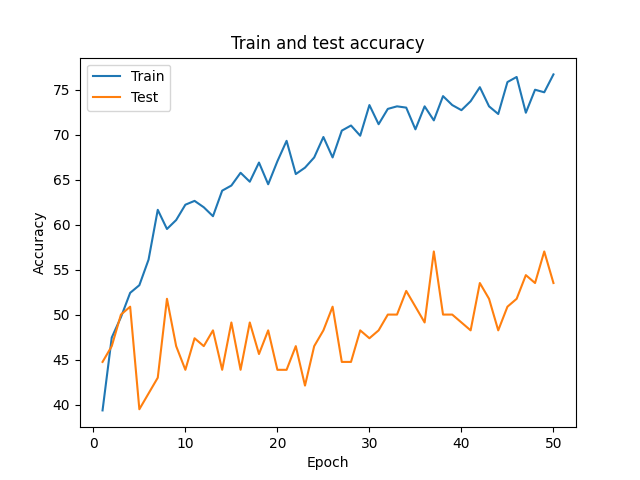

## SHOES CLASSIFICATION (ADIDAS, NIKE, CONVERSE)
### Introduction
Multiclass classification dataset from Kaggle:
https://www.kaggle.com/datasets/die9origephit/nike-adidas-and-converse-imaged  

### Requirements
* Python 3.9
* torch 1.12.0
* torchvision 0.13.0
* torchmetrics 0.10.3
* matplotlib 3.5.1

### Description
Implemented CNN from scratch with Pytorch and compared with pretrained ResNet50.
Tested various optimizers including: SGD, Adam, AdamW.
In experiments I found out that  the best results my CNN gained with SGD + Nesterov momentum and in ResNet - Adam with L2 regularization.

### Results
CNN from scratch: ~50% accuracy  

