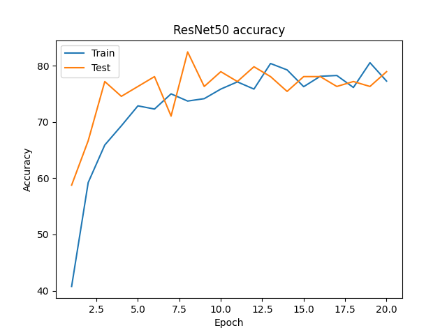

## SHOES CLASSIFICATION (ADIDAS, NIKE, CONVERSE)
### Description
Multiclass classification dataset from Kaggle:
https://www.kaggle.com/datasets/die9origephit/nike-adidas-and-converse-imaged

### Requirements
* Python 3.9
* Pytorch 1.12
* matplotlib

### Description
Implemented CNN from scratch with Pytorch and compared with pretrained ResNet50.
Tested various optimizers including: SGD, Adam, AdamW.
In experiments I found out that  the best results my CNN gained with SGD + Nesterov momentum  
and in ResNet - Adam with L2 regularization.

### Results
CNN from scratch: ~50% accuracy  

ResNet50: ~80% accuracy  

